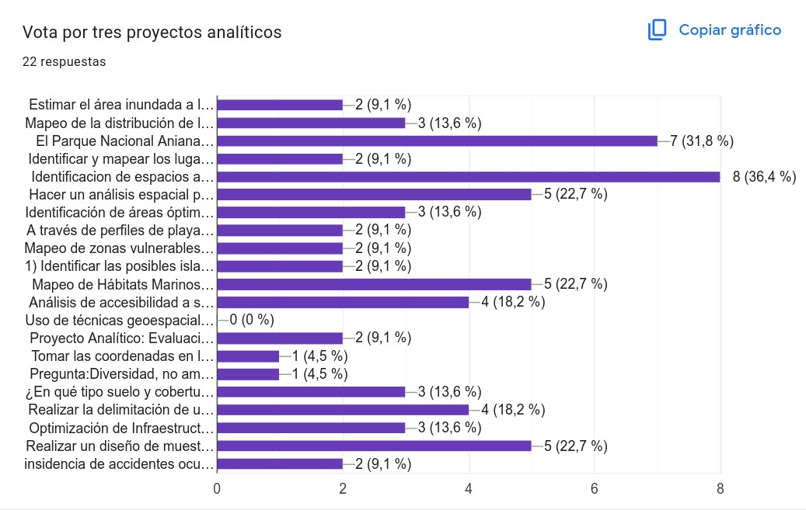
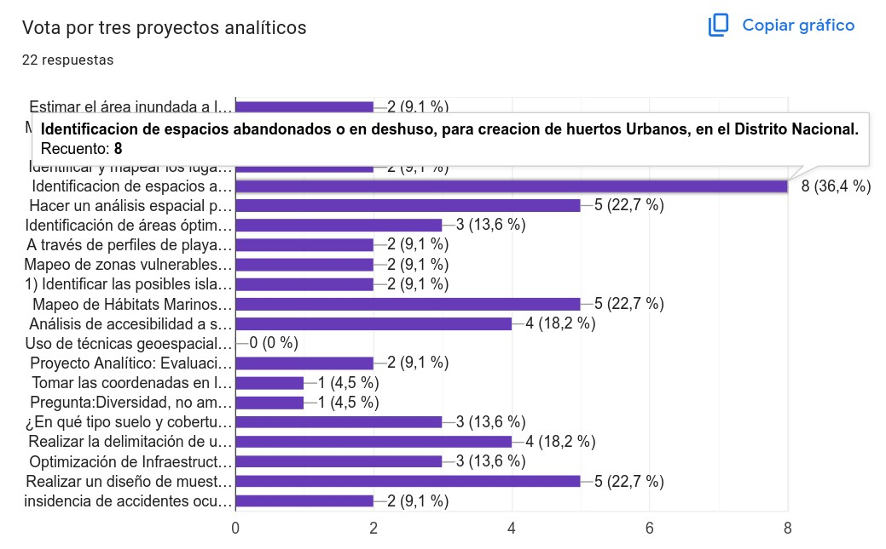
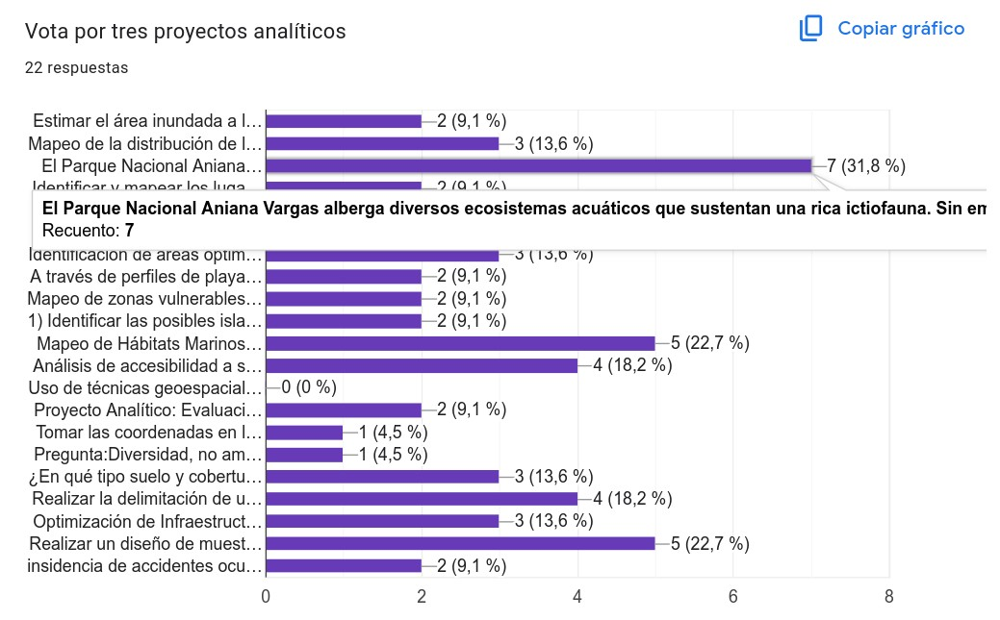

```{r setup, include=FALSE}
knitr::opts_chunk$set(
  cache = FALSE, 
  echo = TRUE,
  warning = FALSE,
  message = FALSE,
  out.width = '100%',
  res = 200,
  dev = 'jpeg')
# options(digits = 3)
options(knitr.duplicate.label = "allow")
```


```{r, include=F}
output_format <- knitr::opts_knit$get("rmarkdown.pandoc.to")
repo_url <- system("git config --get remote.origin.url", intern = TRUE)
repo_name <- sub(".git$", "", basename(repo_url))
org_name <- basename(dirname(repo_url))
rmd_filename <- tools::file_path_sans_ext(basename(knitr::current_input()))
github_pages_url_general <- paste0("https://", org_name, ".github.io/", repo_name, "/")
github_pages_url <- paste0("https://", org_name, ".github.io/", repo_name, "/", rmd_filename, ".html")
github_md_url <- paste0('https://github.com/geofis/curso-tg-junio-2025/blob/main/')
```

```{r, results='asis', echo=F}
if (grepl('gfm', output_format)) {
  cat('Versión HTML (quizá más legible), [aquí](', github_pages_url, ')\n', sep = '')
} else if (output_format == 'latex') {
  cat('Versión HTML (quizá más legible), [aquí](', github_pages_url, ')\n', sep = '')
}
```


## Formulario

Por favor, completa [este formulario](https://docs.google.com/forms/d/e/1FAIpQLSd2RrLAMLmaSsdamjWpMtbJFcVYMshViq6UKPw6qdq-ie5xAQ/viewform?usp=dialog).

## Calendario de oferta de formación continua

Visita [este calendario](https://calendar.google.com/calendar/u/0/embed?src=c_e2675d36ebc399b645ea939b0bfdf0156c9ed9c8805219cd1cc0ef07b82d141f@group.calendar.google.com&ctz=America/Santo_Domingo), por si te interesa la oferta de formación que ofreceré durante este verano.

## Autopresentación

- Nombres, apellidos.

- Formación y/o área profesional.

- Municipio de residencia.

- Una expectativa del curso.

# Presentaciones de diapositivas incluidas en este repo y otros materiales:

- [Motivación](`r paste0(github_pages_url_general, 'media/motivacion.html')`)

- Introducción a R y RStudio. Sesión interactiva.

  - [Tutorial interactivo "Introducción a R"](https://geofis.shinyapps.io/tutorial1/) 

- Introducción a Python, Google Colab y cuadernos Jupyter. Sesión interactiva.

  - Sigue [esta asignación](https://github.com/biogeografia-master/intro-a-python) de la asignatura "Biogeografía" (para acceder a Colab, necesitarás una cuenta de Google).

- [Introducción al análisis espacial o geoespacial](`r paste0(github_pages_url_general, 'media/introduccion-analisis-geoespacial.html')`)

- [Conceptos básicos de SIG y datos geoespaciales](`r paste0(github_pages_url_general, 'media/conceptos-basicos-sig-datos-geoespaciales.html')`)

- [Manipulación de datos geoespaciales con QGIS](`r paste0(github_pages_url_general, 'media/manipulacion-datos-geoespaciales-con-qgis.html')`)

- [Manipulación de datos geoespaciales con R](`r paste0(github_pages_url_general, 'media/manipulacion-datos-geoespaciales-con-r.html')`)

- [Obtención de datos geoespaciales desde la nube](`r paste0(github_pages_url_general, 'media/obtencion-de-datos-geoespaciales-desde-la-nube.html')`)

<!-- - [Análisis espacial (1). Introducción](`r paste0(github_pages_url_general, 'media/analisis-espacial-01.html')`) -->

<!-- - [Análisis espacial (2). Interpolación y geoestadística](`r paste0(github_pages_url_general, 'media/analisis-espacial-02.html')`) -->

<!-- - [Análisis espacial (3). Interpolación y geoestadística. Demo con datos puntuales](`r paste0(github_md_url, 'media/analisis-espacial-02-demo-con-datos-puntuales.md')`) -->

<!-- - [Análisis espacial (4). Autocorrelación espacial](`r paste0(github_md_url, 'media/analisis-espacial-03.md')`) -->

<!-- - [Análisis espacial (5). Autocorrelación espacial. Demo de autocorrelación con datos ecológicos](`r paste0(github_md_url, 'media/analisis-espacial-03-demo-con-datos-ecologicos.md')`) -->

<!-- - [Recapitulando](`r paste0(github_pages_url_general, 'media/recapitulando.html')`) -->

***

## Dirigido a ...

- Estudiantes y profesionales con interés en adquirir o mejorar sus habilidades en análisis geoespacial.

### Objetivo general

Capacitar en tecnologías geoespaciales utilizando lenguajes de programación para resolver problemas y proyectos en diferentes contextos académicos y profesionales.

### Objetivos específicos

- Comprender los fundamentos teóricos del análisis geoespacial y su aplicación en diversos campos.

- Familiarizarse con el entorno de programación R y otros lenguajes, y sus capacidades para el análisis estadístico y geoespacial.

- Introducirse a las técnicas básicas de manipulación y visualización de datos geoespaciales.

- Aprender---o reforzar sobre---el uso básico de QGIS como una herramienta para la visualización, análisis y edición de datos geoespaciales.

- Explorar el uso de algoritmos de inteligencia artificial y aprendizaje automático en el análisis de datos geoespaciales.

<!-- - Integrar técnicas de inteligencia artificial con R y QGIS para la automatización de procesos y la mejora del análisis geoespacial. -->

- Aplicar los conocimientos adquiridos en proyectos prácticos que involucren la manipulación, análisis y visualización de datos geoespaciales utilizando R, QGIS y herramientas de inteligencia artificial.

<!-- - Desarrollar habilidades para interpretar y comunicar los resultados obtenidos mediante el análisis geoespacial utilizando herramientas computacionales. -->

<!-- - Fomentar la capacidad de trabajar de manera colaborativa en proyectos de análisis geoespacial utilizando herramientas y metodologías adecuadas. -->

<!-- - Adquirir una comprensión crítica de las limitaciones y desafíos asociados con el análisis geoespacial con apoyo de inteligencia artificial, así como las posibles aplicaciones futuras de estas técnicas. -->

### Contenido

**Fundamentos de análisis geoespacial**

- Introducción al análisis geoespacial.
- Conceptos básicos de SIG y datos geoespaciales.
- Introducción a la programación con R y QGIS.
- Preparación de datos geoespaciales.

**Manipulación y visualización de datos geoespaciales con R**

- Manipulación de datos espaciales con R.
- Visualización de datos geoespaciales en R.
- Creación de mapas temáticos.

**Manipulación y visualización de datos geoespaciales con Python**

- Manipulación de datos espaciales con Python.
- Visualización de datos geoespaciales en Python.
- Creación de mapas temáticos.

**Introducción a QGIS**

- Instalación y configuración de QGIS.
- Importación y visualización de datos geoespaciales en QGIS.
- Herramientas básicas de análisis y edición.

**Integración de inteligencia artificial en el análisis geoespacial**

- Conceptos básicos de inteligencia artificial y aprendizaje automático.
- Aplicaciones de inteligencia artificial en análisis geoespacial.
- Uso de herramientas de inteligencia artificial.

**Casos de estudio y aplicaciones**

- Exploración de casos de estudio reales que utilizan análisis geoespacial y herramientas de inteligencia artificial
- Aplicaciones prácticas en diversos campos como medio ambiente, urbanismo, salud pública, etc.

```{r}
proyectos <- read.csv("proyectos/proyectos-curso-tg-enero-2025.csv")
kableExtra::kable(proyectos)
```








**Conclusiones y perspectivas futuras**

- Resumen de los conceptos clave aprendidos
- Discusión sobre desafíos y oportunidades en el análisis geoespacial con inteligencia artificial
- Exploración de tendencias y avances futuros en el campo

## Referencias

Bivand, R. S., Pebesma, E., & Gómez-Rubio, V. (2013). Applied Spatial Data Analysis with R. Springer New York. https://doi.org/10.1007/978-1-4614-7618-4

Dorman, M., Graser A., Nowosad, J. & Lovelace, R. (2019). Geocomputation with Python. Chapman and Hall/CRC. https://py.geocompx.org/

Isaaks, E. H., & Srivastava, M. (1989). Applied geostatistics.

Lovelace, R., Nowosad, J., & Muenchow, J. (2019). Geocomputation with R. Chapman and Hall/CRC. https://r.geocompx.org/

Olaya, V. (2020). Sistemas de Información Geográfica. https://volaya.github.io/libro-sig/
