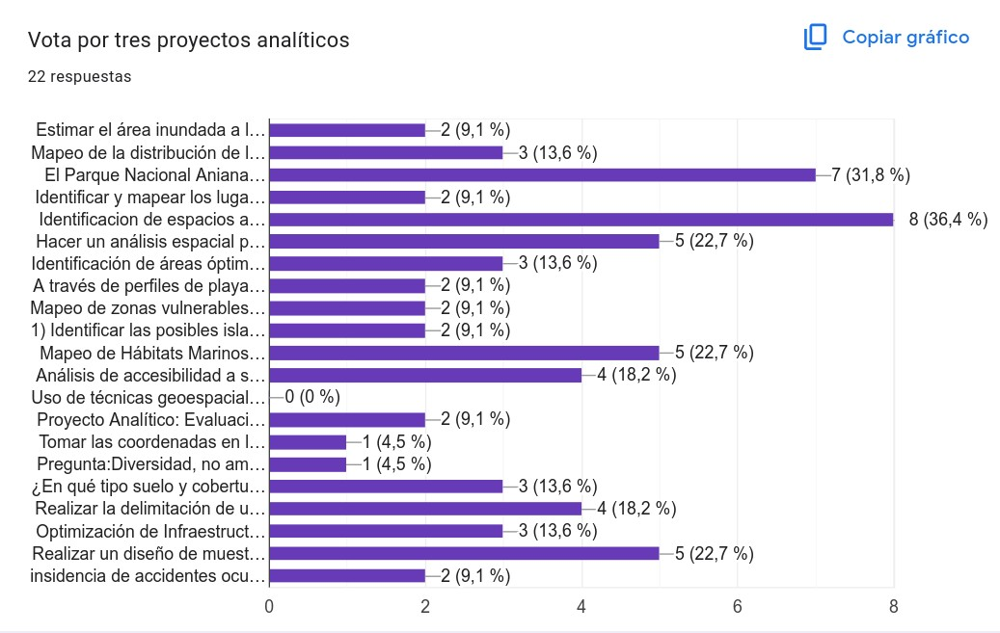
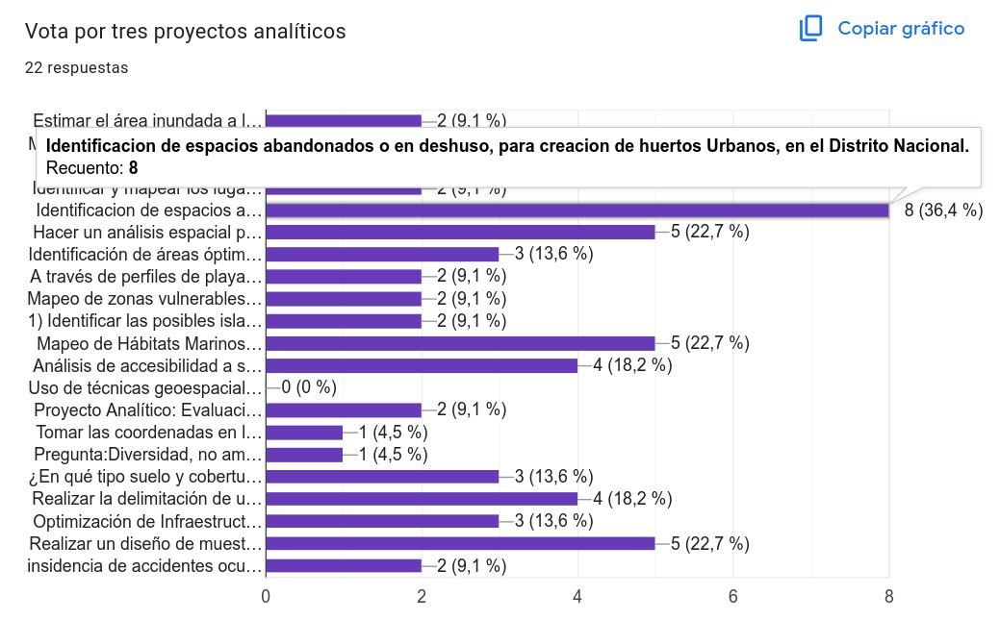
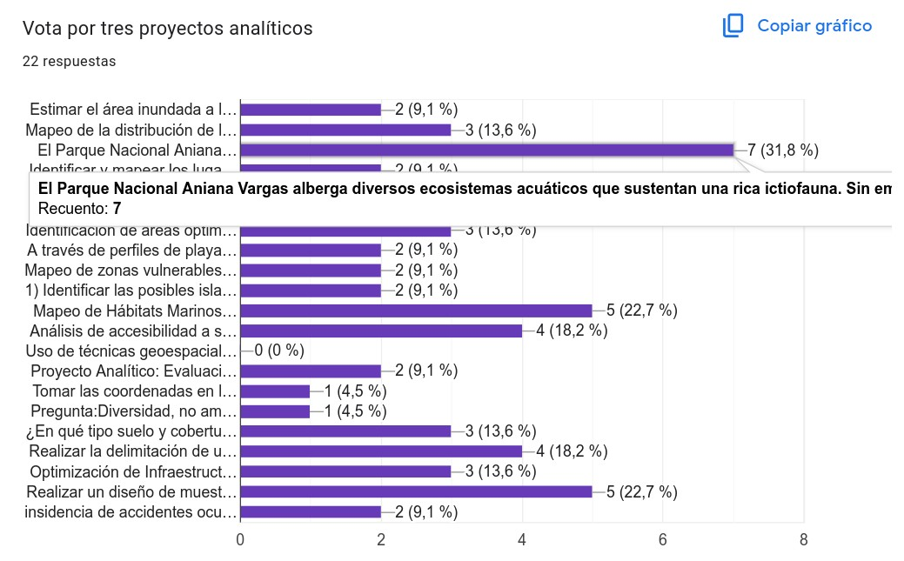

Curso ‘Tecnologías geoespaciales, entre ellas los Sistemas de
Información Geográfica (SIG), nivel intermedio-básico’, junio 2025
================
José Martínez

- [Formulario](#formulario)
- [Calendario de oferta de formación
  continua](#calendario-de-oferta-de-formación-continua)
- [Autopresentación](#autopresentación)
- [Presentaciones de diapositivas incluidas en este repo y otros
  materiales:](#presentaciones-de-diapositivas-incluidas-en-este-repo-y-otros-materiales)
  - [Dirigido a …](#dirigido-a-)
    - [Objetivo general](#objetivo-general)
    - [Objetivos específicos](#objetivos-específicos)
    - [Contenido](#contenido)
  - [Referencias](#referencias)

Versión HTML (quizá más legible),
[aquí](https://geofis.github.io/curso-tg-junio-2025/README.html)

<figure>

<figcaption aria-hidden="true">Código QR para acceder a este
portal</figcaption>
</figure>

## Formulario

Por favor, completa [este
formulario](https://docs.google.com/forms/d/e/1FAIpQLSd2RrLAMLmaSsdamjWpMtbJFcVYMshViq6UKPw6qdq-ie5xAQ/viewform?usp=dialog).

## Calendario de oferta de formación continua

Visita [este
calendario](https://calendar.google.com/calendar/u/0/embed?src=c_e2675d36ebc399b645ea939b0bfdf0156c9ed9c8805219cd1cc0ef07b82d141f@group.calendar.google.com&ctz=America/Santo_Domingo),
por si te interesa la oferta de formación que ofreceré durante este
verano.

## Autopresentación

- Nombres, apellidos.

- Formación y/o área profesional.

- Municipio de residencia.

- Una expectativa del curso.

# Presentaciones de diapositivas incluidas en este repo y otros materiales:

- [Motivación](https://geofis.github.io/curso-tg-junio-2025/media/motivacion.html)

- Introducción a R y RStudio. Sesión interactiva.

  - [Tutorial interactivo “Introducción a
    R”](https://geofis.shinyapps.io/tutorial1/)

- Introducción a Python, Google Colab y cuadernos Jupyter. Sesión
  interactiva.

  - Sigue [esta
    asignación](https://github.com/biogeografia-master/intro-a-python)
    de la asignatura “Biogeografía” (para acceder a Colab, necesitarás
    una cuenta de Google).

- [Introducción al análisis espacial o
  geoespacial](https://geofis.github.io/curso-tg-junio-2025/media/introduccion-analisis-geoespacial.html)

- [Conceptos básicos de SIG y datos
  geoespaciales](https://geofis.github.io/curso-tg-junio-2025/media/conceptos-basicos-sig-datos-geoespaciales.html)

- [Manipulación de datos geoespaciales con
  QGIS](https://geofis.github.io/curso-tg-junio-2025/media/manipulacion-datos-geoespaciales-con-qgis.html)

- [Manipulación de datos geoespaciales con
  R](https://geofis.github.io/curso-tg-junio-2025/media/manipulacion-datos-geoespaciales-con-r.html)

- [Obtención de datos geoespaciales desde la
  nube](https://geofis.github.io/curso-tg-junio-2025/media/obtencion-de-datos-geoespaciales-desde-la-nube.html)

<!-- - [Análisis espacial (1). Introducción](https://geofis.github.io/curso-tg-junio-2025/media/analisis-espacial-01.html) -->
<!-- - [Análisis espacial (2). Interpolación y geoestadística](https://geofis.github.io/curso-tg-junio-2025/media/analisis-espacial-02.html) -->
<!-- - [Análisis espacial (3). Interpolación y geoestadística. Demo con datos puntuales](https://github.com/geofis/curso-tg-junio-2025/blob/main/media/analisis-espacial-02-demo-con-datos-puntuales.md) -->
<!-- - [Análisis espacial (4). Autocorrelación espacial](https://github.com/geofis/curso-tg-junio-2025/blob/main/media/analisis-espacial-03.md) -->
<!-- - [Análisis espacial (5). Autocorrelación espacial. Demo de autocorrelación con datos ecológicos](https://github.com/geofis/curso-tg-junio-2025/blob/main/media/analisis-espacial-03-demo-con-datos-ecologicos.md) -->
<!-- - [Recapitulando](https://geofis.github.io/curso-tg-junio-2025/media/recapitulando.html) -->

------------------------------------------------------------------------

## Dirigido a …

- Estudiantes y profesionales con interés en adquirir o mejorar sus
  habilidades en análisis geoespacial.

### Objetivo general

Capacitar en tecnologías geoespaciales utilizando lenguajes de
programación para resolver problemas y proyectos en diferentes contextos
académicos y profesionales.

### Objetivos específicos

- Comprender los fundamentos teóricos del análisis geoespacial y su
  aplicación en diversos campos.

- Familiarizarse con el entorno de programación R y otros lenguajes, y
  sus capacidades para el análisis estadístico y geoespacial.

- Introducirse a las técnicas básicas de manipulación y visualización de
  datos geoespaciales.

- Aprender—o reforzar sobre—el uso básico de QGIS como una herramienta
  para la visualización, análisis y edición de datos geoespaciales.

- Explorar el uso de algoritmos de inteligencia artificial y aprendizaje
  automático en el análisis de datos geoespaciales.

<!-- - Integrar técnicas de inteligencia artificial con R y QGIS para la automatización de procesos y la mejora del análisis geoespacial. -->

- Aplicar los conocimientos adquiridos en proyectos prácticos que
  involucren la manipulación, análisis y visualización de datos
  geoespaciales utilizando R, QGIS y herramientas de inteligencia
  artificial.

<!-- - Desarrollar habilidades para interpretar y comunicar los resultados obtenidos mediante el análisis geoespacial utilizando herramientas computacionales. -->
<!-- - Fomentar la capacidad de trabajar de manera colaborativa en proyectos de análisis geoespacial utilizando herramientas y metodologías adecuadas. -->
<!-- - Adquirir una comprensión crítica de las limitaciones y desafíos asociados con el análisis geoespacial con apoyo de inteligencia artificial, así como las posibles aplicaciones futuras de estas técnicas. -->

### Contenido

**Fundamentos de análisis geoespacial**

- Introducción al análisis geoespacial.
- Conceptos básicos de SIG y datos geoespaciales.
- Introducción a la programación con R y QGIS.
- Preparación de datos geoespaciales.

**Manipulación y visualización de datos geoespaciales con R**

- Manipulación de datos espaciales con R.
- Visualización de datos geoespaciales en R.
- Creación de mapas temáticos.

**Manipulación y visualización de datos geoespaciales con Python**

- Manipulación de datos espaciales con Python.
- Visualización de datos geoespaciales en Python.
- Creación de mapas temáticos.

**Introducción a QGIS**

- Instalación y configuración de QGIS.
- Importación y visualización de datos geoespaciales en QGIS.
- Herramientas básicas de análisis y edición.

**Integración de inteligencia artificial en el análisis geoespacial**

- Conceptos básicos de inteligencia artificial y aprendizaje automático.
- Aplicaciones de inteligencia artificial en análisis geoespacial.
- Uso de herramientas de inteligencia artificial.

**Casos de estudio y aplicaciones**

- Exploración de casos de estudio reales que utilizan análisis
  geoespacial y herramientas de inteligencia artificial
- Aplicaciones prácticas en diversos campos como medio ambiente,
  urbanismo, salud pública, etc.

``` r
proyectos <- read.csv("proyectos/proyectos-curso-tg-enero-2025.csv")
kableExtra::kable(proyectos)
```

| Marca.temporal                 | Nombres.y.apellidos           | Formula.un.proyecto.analítico..sólo.uno…Como.ves.en.los.ejemplos.arriba..un.proyecto.podría.tener.varios.pasos..pero.la.clave.es.que.sea.una.necesidad.puntual.que.las.técnicas.geoespaciales.podrían.ayudar.a.resolver..máximo..450.palabras.                                                                                                                                                                                                                                                                                                                                                                                                                                  |
|:-------------------------------|:------------------------------|:--------------------------------------------------------------------------------------------------------------------------------------------------------------------------------------------------------------------------------------------------------------------------------------------------------------------------------------------------------------------------------------------------------------------------------------------------------------------------------------------------------------------------------------------------------------------------------------------------------------------------------------------------------------------------------|
| 2025/02/05 8:29:33 p. m. GMT-4 | José Ramón Martínez Batlle    | Estimar el área inundada a la fecha de la imagen satelital más próxima al pico de inundación de un evento elegido convenientemente, utilizando teledetección y algoritmos de clasificación, para responder a la pregunta de cuánta superficie fue afectada, cuántas personas se estima qué fueron afectadas, y cuántas edificaciones se estima que resultaron dañadas                                                                                                                                                                                                                                                                                                           |
| 2025/02/07 5:36:37 p. m. GMT-4 | Ángel María Osoria Guzmán     | Mapeo de la distribución de los vertederos clandestinos en el Distrito Nacional.                                                                                                                                                                                                                                                                                                                                                                                                                                                                                                                                                                                                |
| 2025/02/07 5:38:07 p. m. GMT-4 | Arlen Marmolejo               | El Parque Nacional Aniana Vargas alberga diversos ecosistemas acuáticos que sustentan una rica ictiofauna. Sin embargo, la fragmentación del hábitat debido a actividades humanas y variaciones hidrológicas puede afectar la conectividad entre estos cuerpos de agua, poniendo en riesgo la biodiversidad acuática. Es fundamental evaluar la conectividad de los hábitats acuáticos y su papel en la distribución de especies para diseñar estrategias de conservación basadas en evidencia científica.                                                                                                                                                                      |
| 2025/02/07 5:40:25 p. m. GMT-4 | Gleny M. Sierra Féliz         | Identificar y mapear los lugares de vulnerabilidad en la zona de Sabana Grande de Palenque.                                                                                                                                                                                                                                                                                                                                                                                                                                                                                                                                                                                     |
| 2025/02/07 5:42:16 p. m. GMT-4 | Anabell del Rosario Conce     | Identificacion de espacios abandonados o en deshuso, para creacion de huertos Urbanos, en el Distrito Nacional.                                                                                                                                                                                                                                                                                                                                                                                                                                                                                                                                                                 |
| 2025/02/07 5:43:16 p. m. GMT-4 | Laura Marie Rosario Sánchez   | Hacer un análisis espacial para evaluar la conectividad de bosques fragmentados en un AAPP, por ejemplo, Sierra de Bahoruco a través de imágenes satelitales y modelos de clasificación del uso del suelo y cobertura boscosa. Así ver qué tan aisladas están las manchas en el paisaje y generar un mapa con las manchas y las barreras al movimiento. Tal vez sirva para proponer medidas para mejorar la conectividad de las manchas.                                                                                                                                                                                                                                        |
| 2025/02/07 5:45:00 p. m. GMT-4 | Prefiero anonimato            | Identificación de áreas óptimas para la reforestación urbana mediante análisis geoespacial. (Las características de lo que se considera un área optima y el lugar a determinar más adelante).                                                                                                                                                                                                                                                                                                                                                                                                                                                                                   |
| 2025/02/07 5:45:35 p. m. GMT-4 | Lía de los Santos Ballista    | A través de perfiles de playa, recolectar datos que sirvan de ayuda para analizar las características de las áreas con beachrock en las costas de las playas de la Rep. Dom.                                                                                                                                                                                                                                                                                                                                                                                                                                                                                                    |
| 2025/02/07 5:45:56 p. m. GMT-4 | Juan Gabriel Bautista Disla   | Mapeo de zonas vulnerables a inundaciones en Santo Domingo Oeste                                                                                                                                                                                                                                                                                                                                                                                                                                                                                                                                                                                                                |
| 2025/02/07 5:48:34 p. m. GMT-4 | Prefiero anonimato            | 1\) Identificar las posibles islas de calor urbanas en el Distrito Nacional, Republica Dominicana. 2) Identificar las escuelas y/o politécnicos ubicados en islas de calor urbanas en el Distrito Nacional, Republica Dominicana.                                                                                                                                                                                                                                                                                                                                                                                                                                               |
| 2025/02/07 5:48:39 p. m. GMT-4 | Adrian Rafael Diplán Montás   | Mapeo de Hábitats Marinos en la Playa El Derrumbao (Baní) Mediante SIG para su Identificación y Georreferenciación                                                                                                                                                                                                                                                                                                                                                                                                                                                                                                                                                              |
| 2025/02/07 5:48:48 p. m. GMT-4 | Jeremi Saúl Santana           | Análisis de accesibilidad a servicios de salud en zonas rurales utilizando SIG: Busca analizar la accesibilidad a servicios de salud en zonas rurales utilizando técnicas geoespaciales. Se pretende identificar áreas con acceso limitado a servicios médicos y hospitales para optimizar la distribución de recursos y mejorar la cobertura sanitaria en dichas zonas.                                                                                                                                                                                                                                                                                                        |
| 2025/02/07 5:48:53 p. m. GMT-4 | Carla Jhoanna Valdez González | Uso de técnicas geoespaciales para el análisis y diseño de la cuenca hidrográfica y suelo para resolver la problemática de los sistemas de drenaje pluvial en la provincia de Santo Domingo                                                                                                                                                                                                                                                                                                                                                                                                                                                                                     |
| 2025/02/07 5:48:57 p. m. GMT-4 | Silsy Yokaty Sierra           | Proyecto Analítico: Evaluación del Impacto del Cambio Climático en la Producción Agrícola Mediante Técnicas Geoespaciales                                                                                                                                                                                                                                                                                                                                                                                                                                                                                                                                                       |
| 2025/02/07 5:49:10 p. m. GMT-4 | Llena Sang García             | Tomar las coordenadas en los bordes de una pradera marina con GNSS y seguirlos tomando 2-3 veces por año, durante 2 años, para evaluar cambios en la extensión de la pradera. También tomar datos de densidad de tallos de las diferentes yerbas marinas en una cantidad determinada de puntos y seguir la evolución en la densidad en el periodo de estudio.                                                                                                                                                                                                                                                                                                                   |
| 2025/02/07 5:50:33 p. m. GMT-4 | Lissette Rodríguez            | Pregunta:Diversidad, no amplificación: aumento de producción rubros por parcelas dentro de una misma área de producción agrícola, Valle de San Juan. Muestreo espacial estratificado: cuadrilla de 200m2, Método: teledecteción, basado en ídice de clorofila de las plantas en 3 periodos de la misma fecha.  Cómo colectar datos en terreno: visitas a zonas agrícolas de características similares con GNSS, formularios de identificación de rubros en vista y en campo, etc.  Cómo redactar resultados integrados con código: datos de las bandas, asociadas al rubro, etc. Fuente de Datos satelitales: varias, imágenes satelitales landast para años 2010, 2016, 2022.  |
| 2025/02/07 5:50:39 p. m. GMT-4 | Miguel Landestoy              | ¿En qué tipo suelo y cobertura se encuentran las lagartijas del género Leiocephalus en el Distrito Nacional, República Dominicana? Mapear distribución de Leiocephalus en el Distrito Nacional, y correlacionar el tipo de suelo y su cobertura de suelo.                                                                                                                                                                                                                                                                                                                                                                                                                       |
| 2025/02/07 5:50:53 p. m. GMT-4 | Cyntia Ortiz Rojas            | Realizar la delimitación de una posible área de estudio para realizar censos de aves acuáticas en al menos 4 humedales (lagunas costeras) del sitio Ramsar Humedales de Montecristi                                                                                                                                                                                                                                                                                                                                                                                                                                                                                             |
| 2025/02/07 5:50:56 p. m. GMT-4 | Emmanuel Perdomo              | Optimización de Infraestructura Vial Para las congestiones experimentadas en Santo Domingo y Santiago.                                                                                                                                                                                                                                                                                                                                                                                                                                                                                                                                                                          |
| 2025/02/07 5:51:26 p. m. GMT-4 | Francis De la Rosa            | Realizar un diseño de muestreo espacial estratificado para identificar zonas de alto riesgo sísmico en el Distrito Nacional y optimizar la planificación urbana:                                                                                                                                                                                                                                                                                                                                                                                                                                                                                                                |
| 2025/02/07 5:53:24 p. m. GMT-4 | Perla María Ozuna Guzmán      | insidencia de accidentes ocurridos en el tramo carretero de las americas desde el KM 9 hasta el KM 23 tomando en cuenta la incidencia del oleaje y entrada de viento en la autopista, tomando datos de la plataforma del intrant y del asistencia vial del MOPC tambien tomando en cuenta datos meteorológicos. utilizando GPS y mapas de google Earth. y puntuar los puntos donde mayor concurrencia existe y como la curva del terreno influye en estos.                                                                                                                                                                                                                      |







**Conclusiones y perspectivas futuras**

- Resumen de los conceptos clave aprendidos
- Discusión sobre desafíos y oportunidades en el análisis geoespacial
  con inteligencia artificial
- Exploración de tendencias y avances futuros en el campo

## Referencias

Bivand, R. S., Pebesma, E., & Gómez-Rubio, V. (2013). Applied Spatial
Data Analysis with R. Springer New York.
<https://doi.org/10.1007/978-1-4614-7618-4>

Dorman, M., Graser A., Nowosad, J. & Lovelace, R. (2019). Geocomputation
with Python. Chapman and Hall/CRC. <https://py.geocompx.org/>

Isaaks, E. H., & Srivastava, M. (1989). Applied geostatistics.

Lovelace, R., Nowosad, J., & Muenchow, J. (2019). Geocomputation with R.
Chapman and Hall/CRC. <https://r.geocompx.org/>

Olaya, V. (2020). Sistemas de Información Geográfica.
<https://volaya.github.io/libro-sig/>
